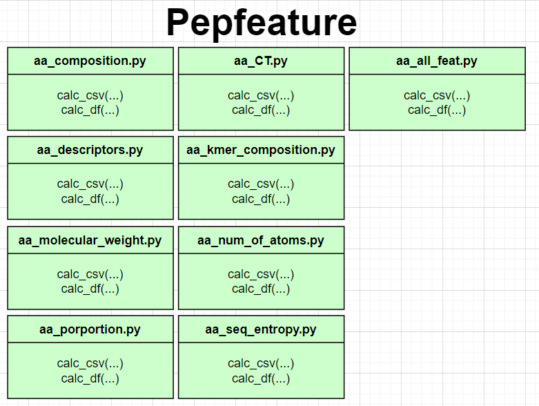
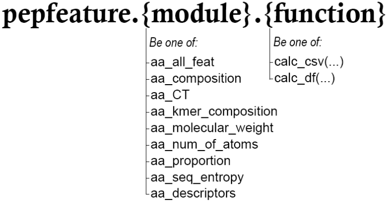

# Pepfeature
### _A package that consists of functions for calculating epitope/peptide features for prediction purposes_


### What is it

**Pepfeature** is a Python package providing routines for calculating peptide features on a given amino acid sequence.
These features can be used for macine learning purposes such as classification for epitiope prediction.

The features it can calculate for a given Amino Acid string sequence are:

| No. |                      Feature                     | Explanation and references to be found in this section of Report.pdf | Calculated in Pepfeature package's Python Module |
|-----|:------------------------------------------------:|----------------------------------------------------------------------|--------------------------------------------------|
| 1   | Proportion of Individual Amino Acids in sequence | 2.3.1                                                                | aa_proportion.py                                 |
| 2   | k-mer Composition                                | 2.3.2                                                                | aa_kmer_composition.py                           |
| 3   | Conjoint Triad Frequencies                       | 2.3.3                                                                | aa_CT.py                                         |
| 4   | Sequence Entropy                                 | 2.3.4                                                                | aa_seq_entropy.py                                |
| 5   | Frequency of AA types                            | 2.3.5                                                                | aa_composition.py                                |
| 6   | Number of atoms                                  | 2.3.6                                                                | aa_num_of_atoms.py                               |
| 7   | Molecular Weight                                 | 2.3.7                                                                | aa_molecular_weight.py                           |
| 8   | AA descriptors                                   | 2.3.8                                                                | aa_descriptors.py                                |

Additionally a module named aa_feat_all.py also exists and it contains functions to calculate all the eight features in one go.


## Pepfeature Requirements
**Required Software/Tools:**  
- Tested on Python 3.8 (other Python 3 versions probably work too)

**Required Package Dependencies:**  
(Pepfeature has been tested on these versions of the dependancies. More recent versions of these dependancies may also be compatible with the Package.)
- et-xmlfile v1.1.0
- setuptools v56.0.0
- numpy v1.20.2
- openpyxl v3.0.7
- pandas v1.2.4
- python-dateutil v2.8.1
- pytz v2021.1
- six v1.15.0


## Installation

```
pip install Pepfeature
```
(All dependancies are expected to be automatically installed asswell with this 'pip install pepfeature' command.)
The source code is currently hosted on GitHub at: https://github.com/essakh/pepfeature

## Example Use
**NOTE: The Github contains an 'examples.py' in the root folder with many example use cases**

**Ensure at all times that any lines of code that utilize this package are executed within the code block:**
```python
if __name__ == '__main__':
```
Example:
```python
import pepfeature as pep
import pandas

df = pd.read_csv('pepfeature/data/Sample_Data.csv')

#Use of pepfeature
if __name__ == '__main__':
    #Calculate all features on df
    df_feat = pep.aa_all_feat.calc_df(dataframe=df, aa_column='Info_window_seq', Ncores=4, k=2)
 
    print(df_feat) #print the data frame to console
```

## Understanding the API

The API interface consists of calling two functions from 9 possibile modules, an overview of the modules and their two callable functions are illustrated in the figure below:



Thus, if in your python script you:
```python
import pepfeature
```
Then you will have the following possible API interfacing options, as illustrated in the image below:


Please see pepfeature/examples.py on the Github repo for example use cases.

## The Data Frame format to input into interface functions

The interface functions are calc_csv & calc_df. They have been detailed in respect to each module in the following section "Functions documentation",

Both the interface functions, viz. calc_csv & calc_df always take an argument 'dataframe' and 'aa_column' in all cases.

The 'dataframe' parameter of both the calc_csv() & calc_df() functions require a pandas Data frame* with at least one column that consists of amino acid sequences; this column's name you must pass as the 'aa_column' parameter into calc_csv() & calc_df() aswell. 
**Note: The Amino Acid sequences to calculate features on can be of varying sizes/lengths.**

*in the example code shown in the 'Example Use' section of this documentation. The line 
```python
df = pd.read_csv('pepfeature/data/Sample_Data.csv') 
```
converts Sample_Data.csv into a pandas Data Frame to then feed into calc_csv() & calc_df().
This Sample_Data.csv exists in the location pepfeature/data/Sample_Data.csv relative from the root of the Github repo. This csv can be used as sample data to try out the package and to gauge what is meant by "A pandas DataFrame that contains a column/feature that is composed of purely Amino-Acid sequences (pepides).".

## Functions documentation
### aa_all_feat
This module contains methods to Calculate all features that this package is capable of calculating in one go, the functions callable either return results as a pandas DataFrame or are exportes as a CSV.

The features calculated by the functions are:
1. Proportion of Individual Amino Acids in sequence
2. k-mer Composition
3. Conjoint Triad Frequencies
4. Sequence Entropy
5. Frequency of Amino Acid types
6. Number of atoms
7. Molecular Weight
8. Amino Acid descriptors

#### pepfeature.aa_all_feat.calc_csv
 Calculates all 8 features that this package calculates at once chunk by chunk from the inputted 'dataframe'. It saves each processed chunk as a CSV(s).
 
  This is a Ram efficient way of calculating the Features as the features are calculated on a single chunk of the dataframe (of chunksize number of rows) at a time and when a chunk has been been processed and saved as a CSV, then the chunk is deleted freeing up RAM.
 
 Results appended as a new column to input dataframe.
```python
pepfeature.aa_all_feat.calc_csv(dataframe, k, save_folder, aa_column = 'Info_window_seq', Ncores = 1, chunksize = None)
```
 **Parameters:**
- **`dataframe`** : `Pandas DataFrame object`
    - A pandas DataFrame that contains a column/feature that is composed of purely Amino-Acid sequences (pepides).
- **`k`** : `int`
    - Length of subsequences (this is used to calculate k-mer composition features)
- **`save_folder`** : `str`
    - Path to folder for saving the output as CSV
- **`aa_column`** : `str`,  `Default='Info_window_seq'`
    - Name of column in dataframe input consisting of the Amino-Acid sequences to process.
- **`Ncores`** : `int`,  `Default=1`
    - Number of cores to use for executing function (multiprocessing).
- **`chunksize`** : `int`,  `Default=None`
    - Number of rows to be processed at a time. (Where a 'None' object denotes no chunks but the entire dataframe to be processed)

#### pepfeature.aa_all_feat.calc_df
Calculate all 8 features that this package calculates at once Results appended as a new column to input dataframe.
```python
pepfeature.aa_all_feat.calc_df(dataframe, k, Ncores = 1, aa_column= 'Info_window_seq')
```
 **Parameters:**
- **`dataframe`** : `Pandas DataFrame object`
    - A pandas DataFrame that contains a column/feature that is composed of purely Amino-Acid sequences (pepides).
- **`k`** : `int`
    - Length of subsequences (this is used to calculate k-mer composition features)
- **`Ncores`** : `int`,  `Default=1`
    - Number of cores to use for executing function (multiprocessing).
- **`aa_column`** : `str`,  `Default='Info_window_seq'`
    - Name of column in dataframe input consisting of the Amino-Acid sequences to process.

 **Returns:**
 - **`Pandas DataFrame object`**
    - A Pandas DataFrame containing the calculated features appended as new columns.


### aa_composition
This module contains functions to calculate Frequency of AA types for given amino acid sequences.
#### pepfeature.aa_composition.calc_csv
Calculates Frequency of AA types for given amino acid sequences chunk by chunk from the inputted 'dataframe'. It saves each processed chunk as a CSV(s). 

This is a Ram efficient way of calculating the Features as the features are calculated on a single chunk of the dataframe (of chunksize number of rows) at a time and when a chunk has been been processed and saved as a CSV, then the chunk is deleted freeing up RAM.

Results appended as a new columns named feat_Prop_{group-value} e.g. feat_Prop_Tiny, feat_Prop_Small etc. 
```python
pepfeature.aa_composition.calc_csv(dataframe, save_folder, aa_column = 'Info_window_seq', Ncores = 1, chunksize = None)
```
 **Parameters:**
- **`dataframe`** : `Pandas DataFrame object`
    - A pandas DataFrame that contains a column/feature that is composed of purely Amino-Acid sequences (pepides).
- **`save_folder`** : `str`
    - Path to folder for saving the output as CSV
- **`aa_column`** : `str`,  `Default='Info_window_seq'`
    - Name of column in dataframe input consisting of the Amino-Acid sequences to process.
- **`Ncores`** : `int`,  `Default=1`
    - Number of cores to use for executing function (multiprocessing).
- **`chunksize`** : `int`,  `Default=None`
    - Number of rows to be processed at a time. (Where a 'None' object denotes no chunks but the entire dataframe to be processed)

#### pepfeature.aa_composition.calc_df

Calculates Frequency of AA types for given amino acid sequences For each sequence calculates nine features corresponding to the proportion (out of 1) of each Amino Acid type in the sequences 

Results appended as a new columns named feat_Prop_{group-value} e.g. feat_Prop_Tiny, feat_Prop_Small etc.
```python
pepfeature.aa_all_feat.calc_df(dataframe, Ncores = 1, aa_column= 'Info_window_seq')
```
 **Parameters:**
- **`dataframe`** : `Pandas DataFrame object`
    - A pandas DataFrame that contains a column/feature that is composed of purely Amino-Acid sequences (pepides).
- **`Ncores`** : `int`,  `Default=1`
    - Number of cores to use for executing function (multiprocessing).
- **`aa_column`** : `str`,  `Default='Info_window_seq'`
    - Name of column in dataframe input consisting of the Amino-Acid sequences to process.

 **Returns:**
 - **`Pandas DataFrame object`**
    - A Pandas DataFrame containing the calculated features appended as new columns.


 
### aa_CT
This module contains functions to calculate conjoint triads features for given amino acid sequences.
#### pepfeature.aa_CT.calc_csv
Calculates conjoint triads features chunk by chunk from the inputted 'dataframe'.
It saves each processed chunk as a CSV(s).

Results appended as a new column named feat_CT_{subsequence} e.g. feat_CT_305 etc.

This is a Ram efficient way of calculating the Features as the features are calculated on a single chunk of the dataframe (of chunksize number of rows) at a time and when a chunk has been been processed and saved as a CSV, then the chunk is deleted freeing up RAM.
```python
pepfeature.aa_CT.calc_csv(dataframe, save_folder, aa_column = 'Info_window_seq', Ncores = 1, chunksize = None)
```
 **Parameters:**
- **`dataframe`** : `Pandas DataFrame object`
    - A pandas DataFrame that contains a column/feature that is composed of purely Amino-Acid sequences (pepides).
- **`save_folder`** : `str`
    - Path to folder for saving the output as CSV
- **`aa_column`** : `str`,  `Default='Info_window_seq'`
    - Name of column in dataframe input consisting of the Amino-Acid sequences to process.
- **`Ncores`** : `int`,  `Default=1`
    - Number of cores to use for executing function (multiprocessing).
- **`chunksize`** : `int`,  `Default=None`
    - Number of rows to be processed at a time. (Where a 'None' object denotes no chunks but the entire dataframe to be processed)

#### pepfeature.aa_CT.calc_df
Calculates conjoint triads features

Results appended as a new column named feat_CT_{subsequence} e.g. feat_CT_305 etc.
```python
pepfeature.aa_CT.calc_df(dataframe, Ncores = 1, aa_column= 'Info_window_seq')
```
 **Parameters:**
- **`dataframe`** : `Pandas DataFrame object`
    - A pandas DataFrame that contains a column/feature that is composed of purely Amino-Acid sequences (pepides).
- **`Ncores`** : `int`,  `Default=1`
    - Number of cores to use for executing function (multiprocessing).
- **`aa_column`** : `str`,  `Default='Info_window_seq'`
    - Name of column in dataframe input consisting of the Amino-Acid sequences to process.

 **Returns:**
 - **`Pandas DataFrame object`**
    - A Pandas DataFrame containing the calculated features appended as new columns.


 
### aa_descriptors
This module contains functions to calculate AA descriptors features for given amino acid sequences.
#### pepfeature.aa_descriptors.calc_csv
Calculates AA descriptors features for given amino acid sequences chunk by chunk from the inputted 'dataframe'.
It saves each processed chunk as a CSV(s).

Results appended as a new columns named feat_{property} e.g. feat_BLOSUM9

This is a Ram efficient way of calculating the Features as the features are calculated on a single chunk of the dataframe (of chunksize number of rows) at a time and when a chunk has been been processed and saved as a CSV, then the chunk is deleted freeing up RAM.
```python
pepfeature.aa_descriptors.calc_csv(dataframe, save_folder, aa_column = 'Info_window_seq', Ncores = 1, chunksize = None)
```
 **Parameters:**
- **`dataframe`** : `Pandas DataFrame object`
    - A pandas DataFrame that contains a column/feature that is composed of purely Amino-Acid sequences (pepides).
- **`save_folder`** : `str`
    - Path to folder for saving the output as CSV
- **`aa_column`** : `str`,  `Default='Info_window_seq'`
    - Name of column in dataframe input consisting of the Amino-Acid sequences to process.
- **`Ncores`** : `int`,  `Default=1`
    - Number of cores to use for executing function (multiprocessing).
- **`chunksize`** : `int`,  `Default=None`
    - Number of rows to be processed at a time. (Where a 'None' object denotes no chunks but the entire dataframe to be processed)
    

#### pepfeature.aa_descriptors.calc_df
Calculates AA descriptors features

Results appended as a new columns named feat_{property} e.g. feat_BLOSUM9

```python
pepfeature.aa_descriptors.calc_df(dataframe, Ncores = 1, aa_column= 'Info_window_seq')
```
 **Parameters:**
- **`dataframe`** : `Pandas DataFrame object`
    - A pandas DataFrame that contains a column/feature that is composed of purely Amino-Acid sequences (pepides).
- **`Ncores`** : `int`,  `Default=1`
    - Number of cores to use for executing function (multiprocessing).
- **`aa_column`** : `str`,  `Default='Info_window_seq'`
    - Name of column in dataframe input consisting of the Amino-Acid sequences to process.

 **Returns:**
 - **`Pandas DataFrame object`**
    - A Pandas DataFrame containing the calculated features appended as new columns.
 
### aa_kmer_composition
This module contains functions to calculate frequency of each k-length contiguous combination of subsequence of amino acid letters in the sequence.
#### pepfeature.aa_kmer_composition.calc_csv
Calculates frequency of each k-length contiguous combination of subsequence of amino acid letters in the sequence chunk by chunk from the inputted 'dataframe'. It saves each processed chunk as a CSV(s). 

Since there are 20 valid Amino Acid letters, there can be 400 ( 20x20) possible 2-letter combination, 8000 (20x20x20) 3-letter combinations, etc. 

Results appended as a new column named feat_Prop_{subsequence} e.g. feat_Prop_AB, feat_Prop_BC etc. 

This is a Ram efficient way of calculating the Features as the features are calculated on a single chunk of the dataframe (of chunksize number of rows) at a time and when a chunk has been been processed and saved as a CSV, then the chunk is deleted freeing up RAM.
```python
pepfeature.aa_kmer_composition.calc_csv(k, dataframe, save_folder, aa_column = 'Info_window_seq', Ncores = 1, chunksize = None)
```
 **Parameters:**
 - **`k`** : `int`
    - Length of subsequences
- **`dataframe`** : `Pandas DataFrame object`
    - A pandas DataFrame that contains a column/feature that is composed of purely Amino-Acid sequences (pepides).
- **`save_folder`** : `str`
    - Path to folder for saving the output as CSV
- **`aa_column`** : `str`,  `Default='Info_window_seq'`
    - Name of column in dataframe input consisting of the Amino-Acid sequences to process.
- **`Ncores`** : `int`,  `Default=1`
    - Number of cores to use for executing function (multiprocessing).
- **`chunksize`** : `int`,  `Default=None`
    - Number of rows to be processed at a time. (Where a 'None' object denotes no chunks but the entire dataframe to be processed)

#### pepfeature.aa_kmer_composition.calc_df
Calculates frequency of each k-length contiguous combination of subsequence of amino acid letters in the sequence. (k-mers in a sequence are all the subsubsequence of length k.) 

Since there are 20 valid Amino Acid letters, there can be 400 ( 20x20) possible 2-letter combination, 8000 (20x20x20) 3-letter combinations, etc.

Results appended as a new column named feat_Prop_{subsequence} e.g. feat_Prop_AB, feat_Prop_BC etc.
```python
pepfeature.aa_kmer_composition.calc_df(k, dataframe, Ncores = 1, aa_column= 'Info_window_seq')
```
 **Parameters:**
- **`k`** : `int`
    - Length of subsequences
- **`dataframe`** : `Pandas DataFrame object`
    - A pandas DataFrame that contains a column/feature that is composed of purely Amino-Acid sequences (pepides).
- **`Ncores`** : `int`,  `Default=1`
    - Number of cores to use for executing function (multiprocessing).
- **`aa_column`** : `str`,  `Default='Info_window_seq'`
    - Name of column in dataframe input consisting of the Amino-Acid sequences to process.

 **Returns:**
 - **`Pandas DataFrame object`**
    - A Pandas DataFrame containing the calculated features appended as new columns.

### aa_molecular_weight
This module contains functions to calculate total molecular weight for given amino acid sequences.
#### pepfeature.aa_molecular_weight.calc_csv
Calculates total molecular weight of the amino acid sequence chunk by chunk from the inputted 'dataframe'.
It saves each processed chunk as a CSV(s).

Results appended as a new column named feat_molecular_weight
This is a Ram efficient way of calculating the Features as the features are calculated on a single chunk of the dataframe (of chunksize number of rows) at a time and when a chunk has been been processed and saved as a CSV, then the chunk is deleted freeing up RAM.
```python
pepfeature.aa_molecular_weight.calc_csv(dataframe, save_folder, aa_column = 'Info_window_seq', Ncores = 1, chunksize = None)
```
 **Parameters:**
- **`dataframe`** : `Pandas DataFrame object`
    - A pandas DataFrame that contains a column/feature that is composed of purely Amino-Acid sequences (pepides).
- **`save_folder`** : `str`
    - Path to folder for saving the output as CSV
- **`aa_column`** : `str`,  `Default='Info_window_seq'`
    - Name of column in dataframe input consisting of the Amino-Acid sequences to process.
- **`Ncores`** : `int`,  `Default=1`
    - Number of cores to use for executing function (multiprocessing).
- **`chunksize`** : `int`,  `Default=None`
    - Number of rows to be processed at a time. (Where a 'None' object denotes no chunks but the entire dataframe to be processed)
    

#### pepfeature.aa_molecular_weight.calc_df
 Calculates total molecular weight of the sequence.

Calculated as a simple weighted sum of amino acid counts, with Amino Acid weights data.
Results appended as a new column named feat_molecular_weight
```python
pepfeature.aa_molecular_weight.calc_df(dataframe, Ncores = 1, aa_column= 'Info_window_seq')
```
 **Parameters:**
- **`dataframe`** : `Pandas DataFrame object`
    - A pandas DataFrame that contains a column/feature that is composed of purely Amino-Acid sequences (pepides).
- **`Ncores`** : `int`,  `Default=1`
    - Number of cores to use for executing function (multiprocessing).
- **`aa_column`** : `str`,  `Default='Info_window_seq'`
    - Name of column in dataframe input consisting of the Amino-Acid sequences to process.

 **Returns:**
 - **`Pandas DataFrame object`**
    - A Pandas DataFrame containing the calculated features appended as new columns.

### aa_num_of_atoms
This module contains functions to calculate for each given sequence the total number of atoms of each type in that sequence (which is essentially a weighted sum of the aminoacid numbers).
#### pepfeature.aa_num_of_atomst.calc_csv
Calculates for each given sequence the total number of
atoms of each type in that sequence (which is essentially a weighted sum of the aminoacid numbers) chunk by chunk from the inputted 'dataframe'.
It saves each processed chunk as a CSV(s).

Results appended as a new columns named feat_C_atoms, feat_H_atoms, feat_N_atoms, feat_O_atoms, feat_S_atoms

This is a Ram efficient way of calculating the Features as the features are calculated on a single chunk of the dataframe (of chunksize number of rows) at a time and when a chunk has been been processed and saved as a CSV, then the chunk is deleted freeing up RAM.
```python
pepfeature.aa_num_of_atomst.calc_csv(dataframe, save_folder, aa_column = 'Info_window_seq', Ncores = 1, chunksize = None)
```
 **Parameters:**
- **`dataframe`** : `Pandas DataFrame object`
    - A pandas DataFrame that contains a column/feature that is composed of purely Amino-Acid sequences (pepides).
- **`save_folder`** : `str`
    - Path to folder for saving the output as CSV
- **`aa_column`** : `str`,  `Default='Info_window_seq'`
    - Name of column in dataframe input consisting of the Amino-Acid sequences to process.
- **`Ncores`** : `int`,  `Default=1`
    - Number of cores to use for executing function (multiprocessing).
- **`chunksize`** : `int`,  `Default=None`
    - Number of rows to be processed at a time. (Where a 'None' object denotes no chunks but the entire dataframe to be processed)
    

#### pepfeature.aa_num_of_atoms.calc_df
 Calculates for each given sequence the total number of
atoms of each type in that sequence (which is essentially a weighted sum of the aminoacid numbers)

Results appended as a new columns named feat_C_atoms, feat_H_atoms, feat_N_atoms, feat_O_atoms, feat_S_atoms
```python
pepfeature.aa_num_of_atoms.calc_df(dataframe, Ncores = 1, aa_column= 'Info_window_seq')
```
 **Parameters:**
- **`dataframe`** : `Pandas DataFrame object`
    - A pandas DataFrame that contains a column/feature that is composed of purely Amino-Acid sequences (pepides).
- **`Ncores`** : `int`,  `Default=1`
    - Number of cores to use for executing function (multiprocessing).
- **`aa_column`** : `str`,  `Default='Info_window_seq'`
    - Name of column in dataframe input consisting of the Amino-Acid sequences to process.

 **Returns:**
 - **`Pandas DataFrame object`**
    - A Pandas DataFrame containing the calculated features appended as new columns.

### aa_porportion
This module contains functions to calculate all the proportion (out of 1) of each Amino Acid in the peptide. 
#### pepfeature.aa_porportion.calc_csv
Calculates the proportion (out of 1) od each Amino-Acid in the peptides (Amino Acid Sequences) chunk by chunk of the inputted 'dataframe'.
It saves each processed chunk as a CSV(s).

This results in 20 new features per chunk, appended as new columns named feat_Prop_{Amino-Acid letter} e.g. feat_Per_A,
feat_Prop_C, ..., feat_Prop_Y.

This is a Ram efficient way of calculating the Features as the features are calculated on a single chunk of the dataframe (of chunksize number of rows) at a time and when a chunk has been been processed and saved as a CSV, then the chunk is deleted freeing up RAM.
```python
pepfeature.aa_porportion.calc_csv(dataframe, save_folder, aa_column = 'Info_window_seq', Ncores = 1, chunksize = None)
```
 **Parameters:**
- **`dataframe`** : `Pandas DataFrame object`
    - A pandas DataFrame that contains a column/feature that is composed of purely Amino-Acid sequences (pepides).
- **`save_folder`** : `str`
    - Path to folder for saving the output as CSV
- **`aa_column`** : `str`,  `Default='Info_window_seq'`
    - Name of column in dataframe input consisting of the Amino-Acid sequences to process.
- **`Ncores`** : `int`,  `Default=1`
    - Number of cores to use for executing function (multiprocessing).
- **`chunksize`** : `int`,  `Default=None`
    - Number of rows to be processed at a time. (Where a 'None' object denotes no chunks but the entire dataframe to be processed)


#### pepfeature.aa_porportion.calc_df
Calculates the proportion (out of 1) of each aminoacid in the peptides (Amino Acid Sequences).

Results appended as a new column named feat_Prop_{aa letter} e.g. feat_Prop_A, feat_Prop_C, ..., feat_Prop_Y.

```python
pepfeature.aa_porportion.calc_df(dataframe, Ncores = 1, aa_column= 'Info_window_seq')
```
 **Parameters:**
- **`dataframe`** : `Pandas DataFrame object`
    - A pandas DataFrame that contains a column/feature that is composed of purely Amino-Acid sequences (pepides).
- **`Ncores`** : `int`,  `Default=1`
    - Number of cores to use for executing function (multiprocessing).
- **`aa_column`** : `str`,  `Default='Info_window_seq'`
    - Name of column in dataframe input consisting of the Amino-Acid sequences to process.

 **Returns:**
 - **`Pandas DataFrame object`**
    - A Pandas DataFrame containing the calculated features appended as new columns.

### aa_seq_entropy
This module contains functions to calculate the entropy of given amino acid sequence
#### pepfeature.aa_seq_entropy.calc_csv
Calculates the entropy of given amino acid sequences chunk by chunk from the inputted 'dataframe'.

It saves each processed chunk as a CSV(s).

Results appended as a new column named feat_seq_entropy

This is a Ram efficient way of calculating the Features as the features are calculated on a single chunk of the dataframe (of chunksize number of rows) at a time and when a chunk has been been processed and saved as a CSV, then the chunk is deleted freeing up RAM.
```python
pepfeature.aa_seq_entropy.calc_csv(dataframe, save_folder, aa_column = 'Info_window_seq', Ncores = 1, chunksize = None)
```
 **Parameters:**
- **`dataframe`** : `Pandas DataFrame object`
    - A pandas DataFrame that contains a column/feature that is composed of purely Amino-Acid sequences (pepides).
- **`save_folder`** : `str`
    - Path to folder for saving the output as CSV
- **`aa_column`** : `str`,  `Default='Info_window_seq'`
    - Name of column in dataframe input consisting of the Amino-Acid sequences to process.
- **`Ncores`** : `int`,  `Default=1`
    - Number of cores to use for executing function (multiprocessing).
- **`chunksize`** : `int`,  `Default=None`
    - Number of rows to be processed at a time. (Where a 'None' object denotes no chunks but the entire dataframe to be processed)
    

#### pepfeature.aa_seq_entropy.calc_df
Calculates the entropy of given amino acid sequences

Results appended as a new column named feat_seq_entropy
```python
pepfeature.aa_seq_entropy.calc_df(dataframe, Ncores = 1, aa_column= 'Info_window_seq')
```
 **Parameters:**
- **`dataframe`** : `Pandas DataFrame object`
    - A pandas DataFrame that contains a column/feature that is composed of purely Amino-Acid sequences (pepides).
- **`Ncores`** : `int`,  `Default=1`
    - Number of cores to use for executing function (multiprocessing).
- **`aa_column`** : `str`,  `Default='Info_window_seq'`
    - Name of column in dataframe input consisting of the Amino-Acid sequences to process.

 **Returns:**
 - **`Pandas DataFrame object`**
    - A Pandas DataFrame containing the calculated features appended as new columns.


 


## Contributing to pepfeature

All contributions, bug reports, bug fixes, documentation improvements, enhancements and ideas are welcome.
